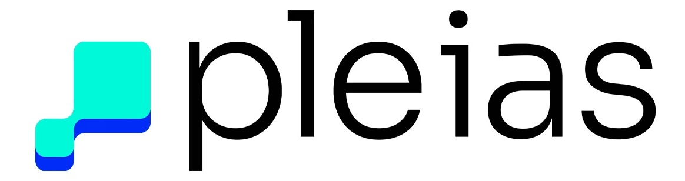

---
base_model:
- PleIAs/Pleias-350m-Preview
language:
- en
- fr
- it
- de
- es
license: apache-2.0
pipeline_tag: text-generation
tags:
- transformers
library_name: transformers
---

# Pleias-RAG-350m

<div align="center">
  
</div>

<p align="center">
  <a href="https://huggingface.co/papers/2504.18225"><b>Full model report</b></a>
</p>

**Pleias-RAG-350M** is a 350 million parameters Small Reasoning Model, trained for retrieval-augmented general (RAG), search and source summarization. Along with Pleias-RAG-1B it belongs to the first generation of Pleias specialized reasoning models.

Pleias-RAG-350M outperform most SLMs (4 billion parameters and below) on standardized benchmarks for retrieval-augmented general (HotPotQA, 2wiki) and is a highly cost effective alternative with popular larger models, including Qwen-2.5-7B, Llama-3.1-8B and Gemma-3-4B. It is the only SLM to date to maintain consistent RAG performance across leading European languages and to ensure systematic reference grounding for statements. 

<p align="center">
  
</p>

Due to its size, ease of deployment on constrained infrastructure (including mobile phone) and built-in support for factual and accurate information, Pleias-RAG-350m unlock a range of new use cases for generative AI.

## Features
Pleias-RAG-350M is a specialized language model using a series of special tokens to process a structured input (query and sources) and generate a structured output (reasoning sequence and answer with sources). For easier implementation, we encourage to use the associated API library.

### Citation support
Pleias-RAG-350M natively generated grounded answers on the basis of excerpts and citations extracted from the provided sources, using a custom syntax inspired by Wikipedia (<ref></ref>) It is one a handful open weights model to date to have been developed with this feature and the first one designed for actual deployment. 

<p align="center">
  
</p>

In contrast with Anthropic approach (*Citation mode*), citation are integrally generated by the model and are not the product of external chunking. As a result we can provide another desirable feature to simplify source checking: citation shortening for longer excerpts (using "(…)").

### RAG reasoning
Pleias-RAG-350M generates a specific reasoning sequences incorporating several proto-agentic abilities for RAG applications. The model is able to make a series of decisions directly:
* Assessing whether the query is understandable.
* Assessing whether the query is trivial enough to not require a lengthy pre-analysis (*adjustable reasoning*)
* Assessing whether the sources do contain enough input to generate a grounded answer.

<p align="center">
  
</p>

The structured reasoning trace include the following steps:
* Language detection of the query. The model will always strive to answer in the language of the original query.
* Query analysis and associated query report. The analysis can either lead to a standard answer, a shortening reasoning trace/answer for trivial question, a reformulated query or a refusal (that could in the context of the application be transformed into user input querying).
* Source analysis and associated source report. This step evaluates the coverage and depth of the provided sources in regards to the query.
* Draft of the final answer.

### Multilinguality
Pleias-RAG-350M is able to read and write in the main European languages: French, German, Italian, Spanish and, to a lesser extent, Polish, Latin and Portuguese.

To date, it is the only small language model with negligible loss of performance in leading European languages for RAG-related tasks. On a translated set of HotPotQA we observed a significant drop of performance in most SLMs from 10\% to 30-35\% for sub-1B models. 

<p align="center">
  
</p>

We do expect the results of any standard English evaluation on Pleias RAG models should be largely transferable to the main European languages limiting the costs of evaluation and deployment in multilingual settings.

## Training
Pleias-RAG-350M is trained on large synthetic dataset emulating retrieval of wide variety of multilingual open sources from Common Corpus. They provide native support for citation and grounding with literal quotes. Following on the latest trends of agentification, the models reintegrate multiple features associated with RAG workflows such as query routing, query reformulation, source reranking.

## Evaluation
Pleias-RAG-350M has been evaluated on three standard RAG benchmarks, 2wiki, HotpotQA and MuSique.

<p align="center">
  
</p>

All the benchmarks only assess the "trivial" mode on questions requiring some form of multi-hop reasoning over sources (answer disseminated into different sources) as well as discrimination of distractor sources.

Pleias-RAG-350M is not simply a cost-effective version of larger models. We found it has been able to answer correctly to several hundred questions from HotPotQA that neither Llama-3-8b nor Qwen-2.5-7b could solve. Consequently we encourage its use as part of multi-model RAG systems.

## Use and deployment
The easiest way to deploy Pleias-RAG-350M is through [our official library](https://github.com/Pleias/Pleias-RAG-Library). It features an API-like workflow with standardized export of the structured reasoning/answer output into json format. A [Colab Notebook](https://colab.research.google.com/drive/1oG0qq0I1fSEV35ezSah-a335bZqmo4_7?usp=sharing) is available for easy tests and experimentations.

A typical minimal example:

```python
rag = RAGWithCitations("PleIAs/Pleias-RAG-350M")

# Define query and sources
query = "What is the capital of France?"
sources = [
    {
        "text": "Paris is the capital and most populous city of France. With an estimated population of 2,140,526 residents as of January 2019, Paris is the center of the Île-de-France metropolitan area and the hub of French economic, political, and cultural life. The city's landmarks, including the Eiffel Tower, Arc de Triomphe, and Cathedral of Notre-Dame, make it one of the world's most visited tourist destinations.",
        "metadata": {"source": "Geographic Encyclopedia", "reliability": "high"}
    },
    {
        "text": "The Eiffel Tower is located in Paris, France. It was constructed from 1887 to 1889 as the entrance to the 1889 World's Fair and was initially criticized by some of France's leading artists and intellectuals for its design. Standing at 324 meters (1,063 ft) tall, it was the tallest man-made structure in the world until the completion of the Chrysler Building in New York City in 1930. The tower receives about 7 million visitors annually and has become an iconic symbol of Paris and France.",
        "metadata": {"source": "Travel Guide", "year": 2020}
    }
]

# Generate a response
response = rag.generate(query, sources)

# Print the final answer with citations
print(response["processed"]["clean_answer"])
```

With expected output:
```
The capital of France is Paris. This can be confirmed by the fact that Paris is explicitly stated to be "the capital and most populous city of France" [1].

**Citations**
[1] "Paris is the capital and most populous city of France" [Source 1]
```

With only 350 million parameters, Pleias-RAG-350M is classified among the *phone-sized SLM*, a niche with very little alternatives (Smollm, Qwen-0.5) and none that currently works well for retrieval-augmented generation.

We also release an unquantized [GGUF version](https://huggingface.co/PleIAs/Pleias-RAG-350M-gguf) for deployment on CPU. Our internal performance benchmarks suggest that waiting times are currently acceptable for most either even under constrained RAM: about 20 seconds for a complex generation including reasoning traces on 8g RAM and below. Since the model is unquantized, quality of text generation should be identical to the original model.

Once integrated into a RAG system, Pleias-RAG-350M can also be use in a broader range of non-conversational use cases including user support or educational assistance. Through this release, we aims to make tiny model workable in production by relying systematically on an externalized memory.

Github repository: https://github.com/Pleias/Pleias-RAG-Library